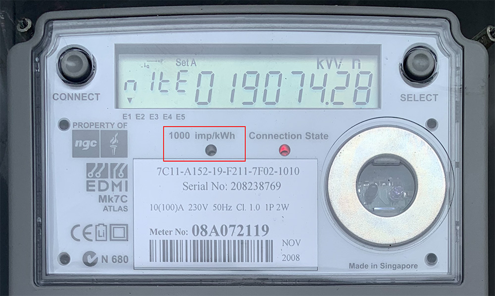
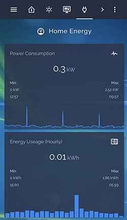
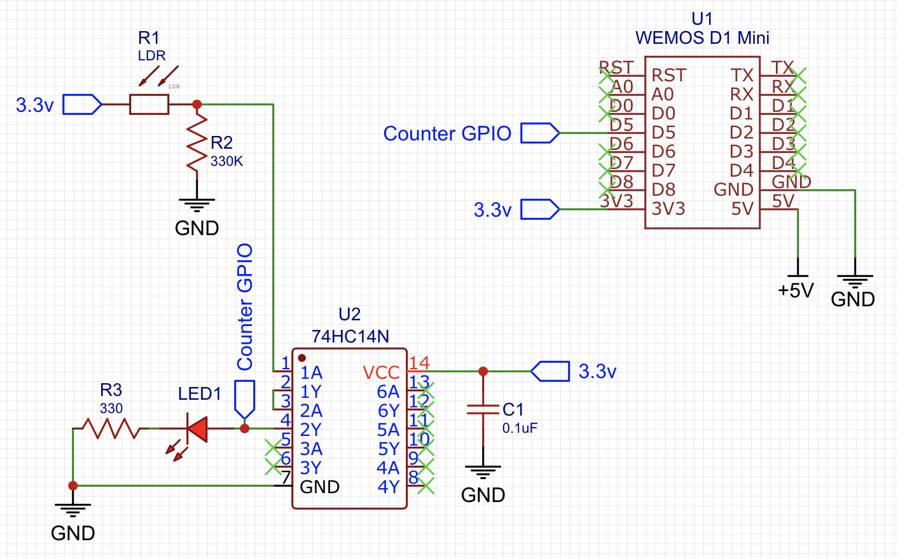
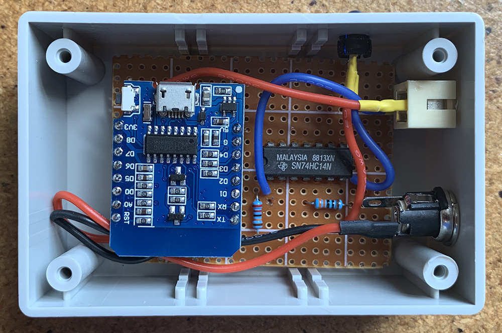
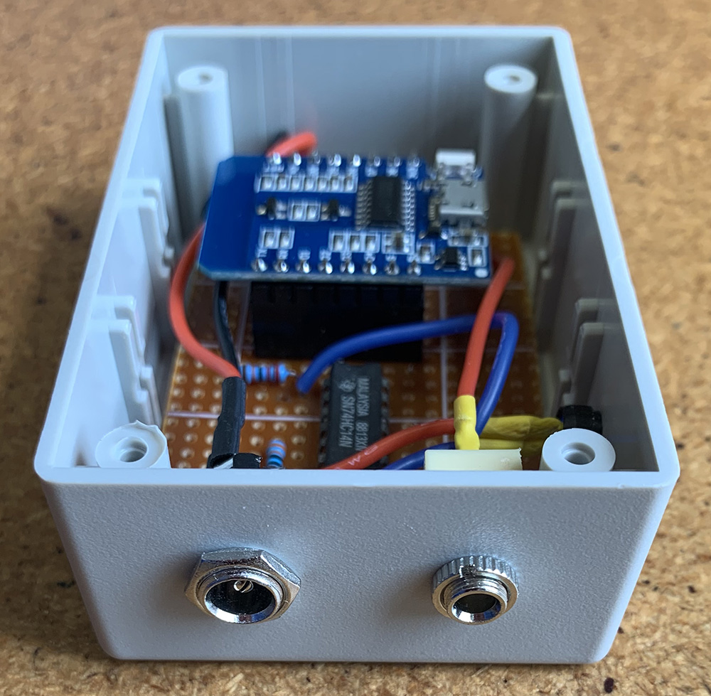
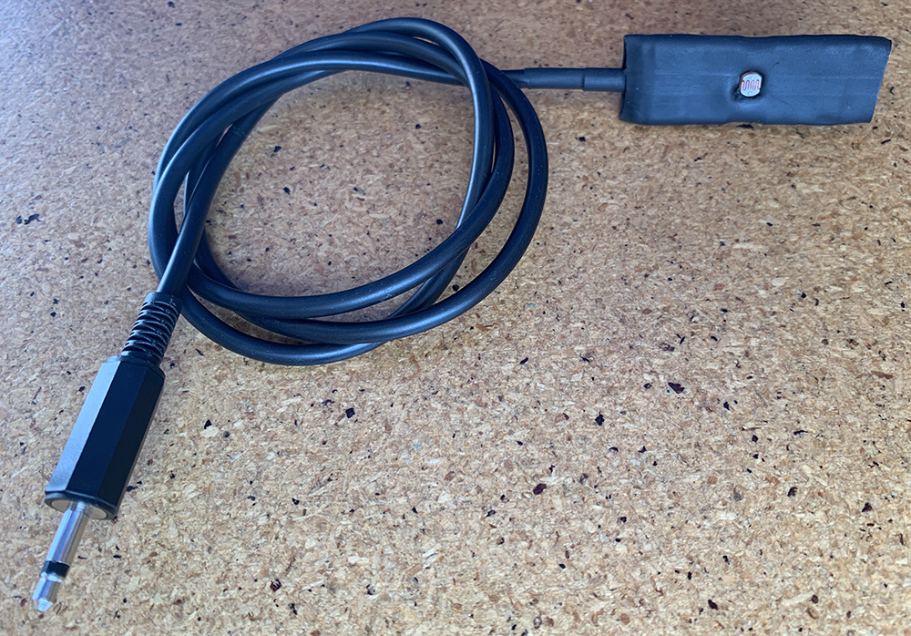
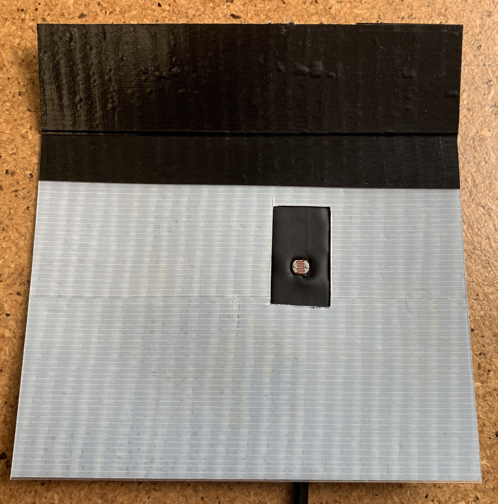

# Non-intrusive Power Meter for ESPHome and Home Assistant
A super simple non-intrusive circuit for measuring power consumption and reporting back to Home Assistant.

Many homes these days have "smart" power meters that provide a means of non-invasive integration by counting the pulses from an indicator LED.

My homes smart meter, an EDMI MK7C (a common model used here in New Zealand), flashes 1000 times for every kilowatt consumed. By counting the pulses that occur in a 60 second window it is easy to obtain real time power consumption.

Power data is fed to a Home Assistant "integration" sensor to calculate hourly, daily, and weekly power consumption data for display within a Home Assistant dashboard.

## Circuit
The circuit is super simple, being based on an inexpensive Light Dependant Resistor (LDR) and a CMOS 74HC14 hex inverting schmitt trigger. The schmitt trigger buffers the signal from the LDR such that it can drive a GPIO input on a Wemos D1 Mini, as well as drive an LED that pulses in unison with the smart meter (useful for ensuring the LDR is correctly positioned over top of the smart meters pulse LED).

## Prototype

The prototype was assembled on veroboard and housed within a small project box.

The LDR sensor was soldered to an offcut of veroboard and connects to the project box by way of a 3.5mm mono audio plug and socket.

In practise my power box gets a lot of sunlight so the LDR sensor had to have a sunlight shroud made. I used a plastic takeaway box lid and covered it with black gaffer tape. This is simply velcroed into position so that future visits from my power company can quickly remove :)

